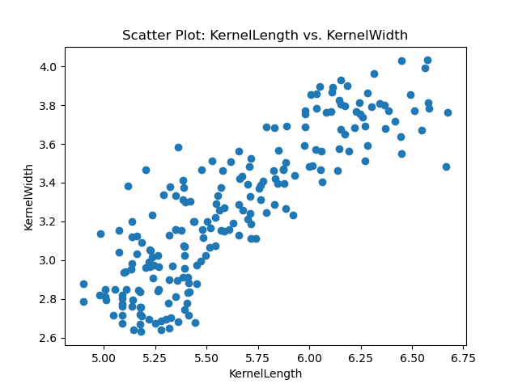

# Unsupervised Learning

Author: Andrew Farell

## Overview

I am looking at a dataset containing geometrical measurements of wheat kernels. In the data ach observation represents a single kernel, described by seven features derived from its shape. The features are:

1. **Area** – the area of the kernel  
2. **Perimeter** – the total outer boundary length  
3. **Compactness** – $ C = \frac{4 \pi \times \text{Area}}{\text{Perimeter}^2} $  
4. **KernelLength** – the major axis length of the kernel  
5. **KernelWidth** – the minor axis length of the kernel  
6. **AsymmetryCoeff** – a measure of asymmetry in the kernel shape  
7. **KernelGroove** – the length of the central groove running longitudinally along the kernel  

The dataset is described below using `df.describe()` in python:
|       Statistic      |     Area    |  Perimeter  | Compactness | KernelLength | KernelWidth | AsymmetryCoeff | KernelGroove | Class |
|:--------------------:|:-----------:|:-----------:|:-----------:|:------------:|:-----------:|:--------------:|:------------:|:-----:|
| **count**            | 210.000000  | 210.000000  | 210.000000  | 210.000000   | 210.000000  | 210.000000     | 210.000000   | 210.000000 |
| **mean**             | 14.847524   | 14.559286   | 0.870999    | 5.628533     | 3.258605    | 3.700201       | 5.408071     | 2.000000 |
| **std**              | 2.909699    | 1.305959    | 0.023629    | 0.443063     | 0.377714    | 1.503557       | 0.491480     | 0.818448 |
| **min**              | 10.590000   | 12.410000   | 0.808100    | 4.899000     | 2.630000    | 0.765100       | 4.519000     | 1.000000 |
| **25%**              | 12.270000   | 13.450000   | 0.856900    | 5.262250     | 2.944000    | 2.561500       | 5.045000     | 1.000000 |
| **50%**              | 14.355000   | 14.320000   | 0.873450    | 5.523500     | 3.237000    | 3.599000       | 5.223000     | 2.000000 |
| **75%**              | 17.305000   | 15.715000   | 0.887775    | 5.979750     | 3.561750    | 4.768750       | 5.877000     | 3.000000 |
| **max**              | 21.180000   | 17.250000   | 0.918300    | 6.675000     | 4.033000    | 8.456000       | 6.550000     | 3.000000 |

Although the dataset has labels indicating different varieties of wheat, I intend to apply an unsupervised learning approach. This means I will temporarily disregard those labels. My goal is to use clustering to discover natural groupings within the data via relying solely on the measured properties rather than on any external categorization. I will then compare these groupings to the known wheat varieties (once clusters have been established). I hope to gauge how effectively the inherent geometry of the kernels discriminates between different wheat types, or whether new and potentially insightful cluster structures emerge.

**Objective**
Clustering is a process in which I partition the data into subgroups (clusters) of observations that are more similar to one another, in terms of their geometric attributes, than to observations in other clusters. The mathematical objective can is to minimize a criterion such as the overall within-cluster variance. In the case of k-means clustering, I will select a number of clusters $k$, initialize cluster centers, and iteratively reassign each kernel to the nearest center based on a distance metric (often Euclidean distance), then update cluster centers until convergence. I will see whether these naturally formed clusters correspond to distinct wheat varieties or potentially reveal more nuanced structures in the data. This unsupervised learning process and preliminary EDA can provide further insight into the key features that drive cluster formation.

## EDA

The dataset has 210 wheat kernels. These are each described by seven geometric attributes (Area, Perimeter, Compactness, KernelLength, KernelWidth, AsymmetryCoeff, and KernelGroove), plus a Class label (1, 2, or 3). There are no missing values. Area spans from 10.59 to 21.18 with a mean of 14.85, while Perimeter ranges from 12.41 to 17.25 (mean 14.56). Compactness lies between 0.8081 and 0.9183, and KernelLength and KernelWidth exhibit medians of 5.52 and 3.24, respectively. This shows that kernels tend to be longer than they are wide. AsymmetryCoeff varies substantially, from roughly 0.77 to 8.46, and KernelGroove has a mean of about 5.41, spanning 4.52 to 6.55.

Regarding correlations, Area, Perimeter, KernelLength, and KernelWidth are highly interrelated, indicating that kernels exhibiting large area also tend to have a large perimeter and extended lengths and widths. This is obvious, so I'm wondering if the data is highly redundant.  AsymmetryCoeff shows a moderate negative correlation with KernelWidth and a positive correlation with the class label, hinting that varieties may differ partly based on asymmetry. 

Some of the EDA figures I generated are below.

## K-Means Clustering and Results

The clustering analysis was performed on the seeds dataset using K-Means for a range of $k$ values from 2 to 10. **The total within-cluster sum of squares, known as “inertia,” decreases steadily as $k$ increases**, reflecting the finer segmentation into more clusters. When $k=2$, the inertia is approximately 1011.7, and it drops sharply to about 587.3 at $k=3$, **indicating a major improvement in partitioning the kernels**. Increasing $k$ beyond 3 continues to reduce the inertia—falling to around 203.4 by $k=10$—though **the rate of improvement lessens with each additional cluster**.

These observations align with the typical “elbow” pattern, where an optimal $k$ can be selected by balancing the desire for low inertia against the diminishing returns and added complexity of introducing more clusters. In this case, $k=3$ emerges as a sensible choice because it yields a substantial jump in clustering quality from $k=2$ while avoiding too many narrowly defined groups. Nonetheless, depending on specific research objectives—such as identifying subtle varietal distinctions or exploring subgroups within a given strain—researchers may justify selecting other $k$ values to meet more specialized requirements.

Some of the resultsfigures I generated are below.

- **Inertia Plot**  
  

- **Example of Color-coded Scatter Plot for $k=3$**  
  

## Conclusion

Through this unsupervised learning analysis, I have identified natural groupings in the geometric properties of wheat kernels. While a simple elbow-based selection suggests three clusters, alternate choices of $k$ might capture finer distinctions or highlight additional structure in the data. This approach demonstrates how clustering—complemented by rigorous EDA—can reveal potentially meaningful subgroups without requiring class labels, thereby offering new perspectives on kernel morphology and variety identification.
